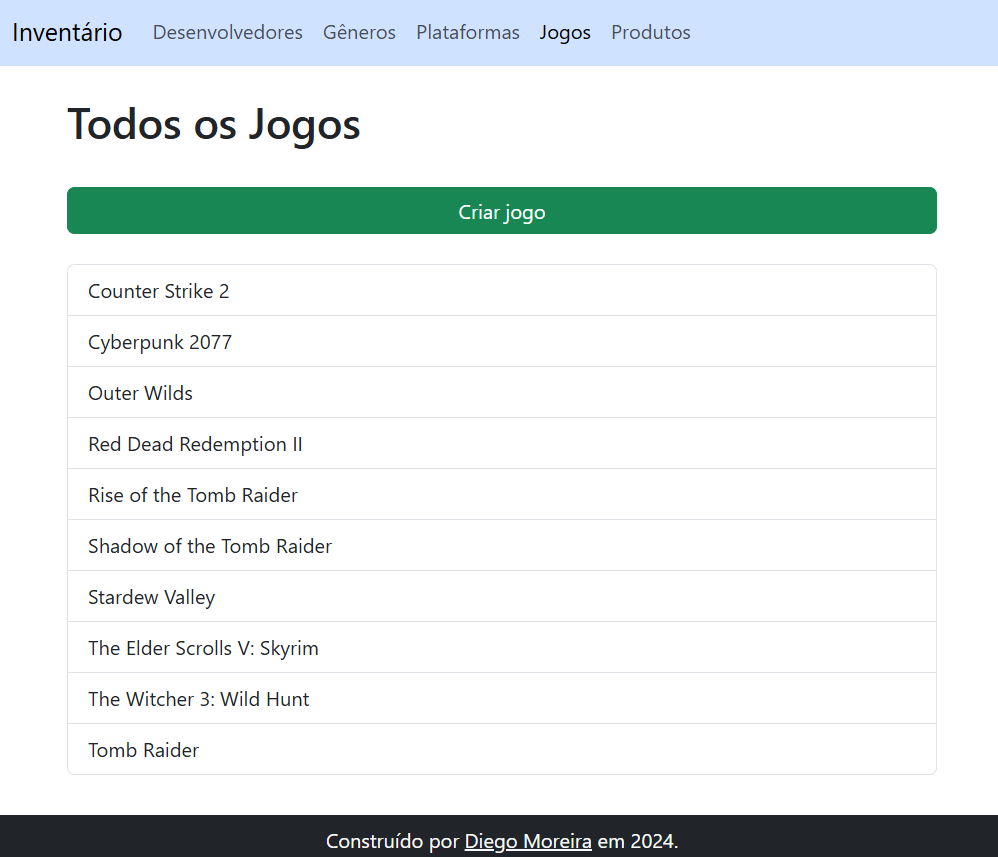
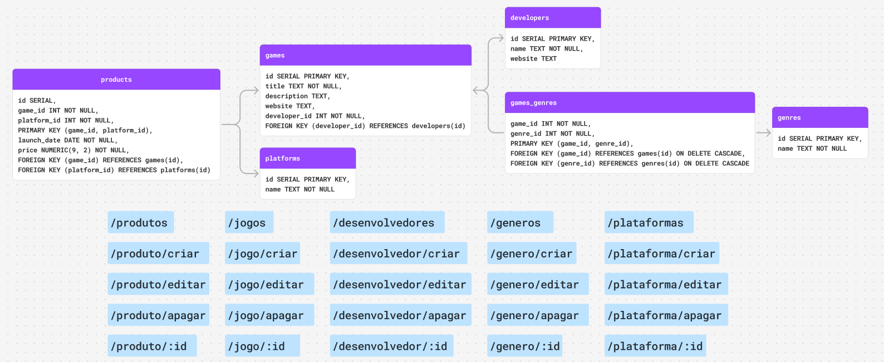

# App de Inventário

Este é um projeto de um sistema de inventário fictício proposto pelo site [The Odin Project](https://www.theodinproject.com/) para fixar o aprendizado sobre PostgreSQL. Um exemplo do projeto está online em: [odin-inventory.glitch.me](https://odin-inventory.glitch.me/).



## Tecnologias Utilizadas

- Node.js
- Express.js
- PostgreSQL
- EJS
- Bootstrap

## Modelagem de Dados e Rotas



## Como Executar

1. **Clone o repositório:**

```bash
git clone https://github.com/Diego-Moreira8/odin-inventory.git
```

2. **Instale as dependências:**

```bash
cd odin-inventory
npm install
```

3. **Configure o banco de dados:**

- Certifique-se que o PostgreSQL está instalado e em execução.
  - Caso precise de ajuda para instalar, [esta lição](https://www.theodinproject.com/lessons/nodejs-installing-postgresql#installing-postgresql) pode ser de grande ajuda.
- Crie o banco de dados.
  - Confira [esta lição](https://www.theodinproject.com/lessons/nodejs-using-postgresql#setting-up-the-db) caso precise de ajuda sobre como criar um banco de dados.
- Crie um arquivo .env na raiz do projeto com o URI de conexão da base de dados. Confira o arquivo .env.example se precisar de um exemplo.
- Execute o script para criação das tabelas:

```bash
node db/createTables.js
```

- **(Opcional)** Execute o script para popular as tabelas:

```bash
node db/populate/createTables.js
```

Esse script limpa as tabelas e insere alguns dados de exemplo.

4. **Execute o aplicativo:**

```bash
npm run dev
```

Isso iniciará um servidor de desenvolvimento local na porta 3000.

---

_Nota: Este projeto é apenas para fins educacionais e de aprendizado. Não é recomendado para uso em produção sem considerar práticas de segurança adequadas._
